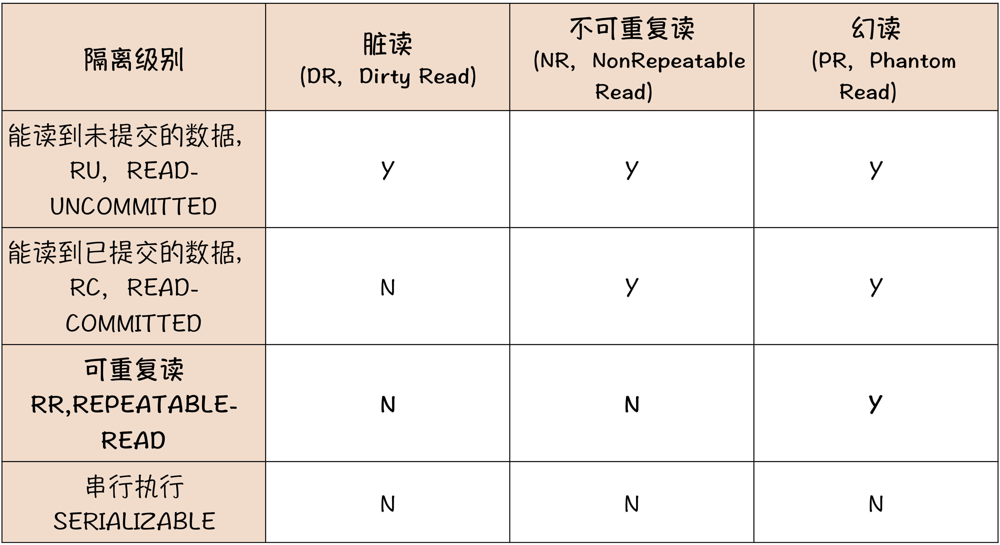

## 四个基本特性ACID
### 原子性
要么都成功，要么都失败
### 一致性
无论是事务发生前和是否发生后，我们读到的数据总是一致的
### 隔离性
为了实现一致性，必须保证每个事务的执行过程中，中间状态对其他事务是不可见的
### 持久性
只要事务提交成功，数据一定会被持久化到磁盘中，后续及时发生数据库宕机，也不会改变事务的结果

## 事务的隔离级别

不使用事务可能产生的影响

脏读，不可重复读，幻读

隔离级别
- 读未提交(RU)
- 读提交(RC)
- 可重复读(RR)
- 串行化(SERIALIZABLE)

性能逐渐下降，MySQL默认RR(可重复读)

RU，读提交，实际上就是完全不隔离。每个进行中的事务的状态，其他事务都是可见的。因此可能会出现脏读的情况。
对于程序来说是很难处理的，所以基本不用

串行化(序列表)，是最完美的“隔离性”与“一致性”，但是性能最差，所以也很少用到

最常用的是RC和RR。这两种隔离级别都是可以避免脏读，能够保证在其他事务中是不会读到未提交的事务的数据。
或者通俗地说，**只要你的事务没有提交，那这个事务对数据做出的更新，其他会话是不可见的，他们读到还是你这个事务更新之前的数据**

RC 和 RR 唯一的区别在于“是否可重复读”，这个概念也有点儿绕口，但其实也很简单。**在一个事务执行过程中，它能不能读到其他已提交事务对数据的更新，如果能读到数据变化，就是“不可重复读”，否则就是“可重复读”。**