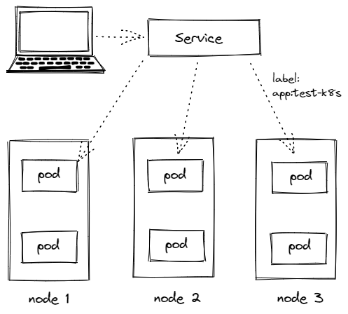

## 特性
- Service 通过 label 关联对应的 Pod
- Service 生命周期不跟 Pod 绑定，不会因为 Pod 重创改变 IP
- 提供了负载均衡功能，自动转发流量到不同 Pod
- 可对集群外部提供访问端口
- 集群内部可通过服务名字访问


## 创建 Service
### ClusterIP
```yaml
apiVersion: v1
kind: Service
metadata:
  name: mysql-svc
spec:
  selector:
    app: mysql
  # 默认 ClusterIP 集群内可访问(不写也行)，NodePort 节点可访问，LoadBalancer 负载均衡模式（需要负载均衡器才可用）
  type: ClusterIP
  ports:
    - port: 3306 # 本 Service 的端口
      targetPort: 3306 # Pod 端口
```
### NodePort
```yaml
apiVersion: v1
kind: Service
metadata:
  name: redis-public
spec:
  selector:
    app: redis
  type: NodePort
  ports:
    - port: 6379 # 本 Service 端口
      targetPort: 6379 # Pod 端口
      nodePort: 31000 # 节点端口，默认范围 30000 ~ 32767
    - port: 16379 # 多端口示例
      targetPort: 16379
      nodePort: 32000
```

## Service 类型
##### ClusterIP
默认的，仅在集群内可用
##### NodePort
暴露端口到节点，提供了集群外部访问的入口
端口默认范围 30000 ~ 32767
##### LoadBalancer
需要负载均衡器（通常需要云服务商提供），会额外生成一个IP对外服务
##### Headless
适合数据库
```yaml
clusterIP: None
```
写入以上配置就变成 Headless 了，不会再分配 IP